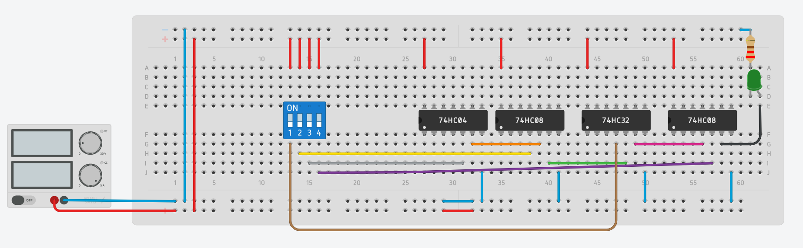

# Sprint 02 – Sistema Inteligente de Prioridade Energética
**GoodWe Smart Energy Controller**

Este repositório contém o projeto de desenvolvimento de um **Sistema Inteligente de Prioridade Energética**, inspirado nas soluções reais de gerenciamento de energia solar, armazenamento de baterias e eficiência da **GoodWe**. O projeto foi concebido como parte das atividades práticas da disciplina de Arquitetura de Computadores.

## Equipe do Projeto

| Nome | RM |
| :--- | :---: |
| **Luca Almeida Lucareli** | `569061` |
| **Leonardo Scotti Tobias** | `573305` |
| **Henrique Almeida Lucareli** | `569183` |
| **Natan Silva da Costa** | `573100` |
| **Enzo Seiji Delgado Tabuchi** | `573156` |

---

## Desafio e Contextualização

O objetivo central do projeto é projetar e implementar um mecanismo automático de tomada de decisão digital para gerenciar o acionamento de uma **Carga Elétrica Prioritária** (como um refrigerador inteligente, sistema de segurança, roteador ou equipamento hospitalar de suporte à vida). 

O sistema avalia em tempo real a disponibilidade de fontes renováveis (energia solar), o nível de armazenamento (bateria) e o período do dia (horário de pico) para decidir se a carga pode ou não ser ativada com segurança e eficiência.

### Variáveis de Entrada do Sistema

O sistema opera com base em 4 entradas digitais (nível lógico `0` ou `1`):

| Variável | Significado | Bit `0` | Bit `1` |
| :---: | :--- | :--- | :--- |
| **A** | Energia Solar Disponível | Indisponível | Disponível |
| **B** | Bateria acima de 40% | Abaixo de 40% | Acima de 40% |
| **C** | Horário de Pico Energético | Fora do Pico | Em Horário de Pico |
| **D** | Equipamento Prioritário | Não Solicitado | Solicitado |

### Saída do Sistema

* **S (Carga Prioritária):** * `0` = Carga não autorizada *(LED desligado)*.
  * `1` = Carga prioritária autorizada *(LED ligado)*.

---

## Interface e Funcionamento Lógico

Abaixo está a representação conceitual do fluxo de decisão em hardware do sistema:

```text
[Botão A: Solar] ───┐
                    ├───> [ Lógica de Decisão ] ───> [ Porta AND Final ] ───> [ LED Saída S ]
[Botão B: Bater.] ──┤            ▲                               ▲
                    │            │                               │
[Botão C: Pico] ────┴───> [ Porta NOT ]                          │
                                                                 │
[Botão D: Solicitado] ───────────────────────────────────────────┘

```

### Regras de Negócio Operacionais:

1. A carga prioritária só pode ser ligada se for explicitamente solicitada ($D = 1$).
2. Deve haver alguma fonte disponível: energia solar ($A = 1$) **OU** bateria suficiente ($B = 1$).
3. **Restrição Crítica:** Durante o horário de pico ($C = 1$), a bateria é poupada e o sistema **apenas** permite o acionamento se houver energia solar direta ($A = 1$).

---

## Expressão Lógica e Simplificação Booleana

### a) Expressão Original do Problema

Dividindo o comportamento do sistema nos dois cenários mapeados pelo Horário de Pico ($C$), estruturamos a seguinte expressão lógica:

1. **Fora do horário de pico ( $\overline{C}$ ):** Autorizado se houver solar **OU** bateria ( $A + B$ ), **E** o equipamento for solicitado ( $D$ ).
2. **Durante o horário de pico ( $C$ ):** Autorizado **APENAS** se houver solar ( $A$ ), **E** o equipamento for solicitado ( $D$ ).

Unindo os termos através de uma porta **OR** ($+$), obtemos as expressões abaixo:

* **Expressão bruta inicial:**

$$S = (\overline{C} \cdot (A + B) \cdot D) + (C \cdot A \cdot D)$$


* **Expressão simplificada (Otimizada):**

$$S = D \cdot (A + B \cdot \overline{C})$$


### Impacto no Hardware e Otimização

A expressão simplificada final exige apenas **4 portas lógicas** ao invés da estrutura complexa original, garantindo eficiência, menor custo e menos pontos de falha no protoboard:

1. Porta **NOT** para inverter a variável $C$ ($\overline{C}$).
2. Porta **AND** para a conjunção da bateria com a ausência de pico ($B \cdot \overline{C}$).
3. Porta **OR** para a soma lógica com a energia solar ($A + B \cdot \overline{C}$).
4. Porta **AND** final para validar a solicitação do equipamento ($D \cdot \dots$).

---

## Tabela Verdade

A análise completa de todas as 16 combinações binárias possíveis do sistema está consolidada e documentada detalhadamente no arquivo Excel que acompanha este repositório.

* **Arquivo de Dados:** [`tabela_verdade.xlsx`](./tabela_verdade.xlsx)
* **Resumo Operacional:** O LED indicador (Saída $S$) só acenderá nas linhas em que a condição simplificada $D \cdot (A + B \cdot \overline{C}) = 1$ for perfeitamente atendida.

---

## Simulação do Circuito no Tinkercad

O circuito digital completo foi montado e testado utilizando chaves/botões (DIP Switch) para simular as variáveis de entrada, circuitos integrados (CIs) das portas lógicas fundamentais da família TTL (7404, 7408, 7432) e um LED com resistor limitador de corrente para representar a saída $S$.

### Link do Projeto Interativo

* **[Acessar Simulação no Tinkercad](https://www.tinkercad.com/things/eUJlglfcRt0-cp2-portas-logicas-e-sistemas-digitais?sharecode=d4906sj5frh_jOP1oXR7U2ujvfwL08_vq4mcWJ5V750)**

### Imagem do Circuito Montado
Abaixo está o mapeamento visual do protoboard e das conexões lógicas estruturadas durante a simulação:

